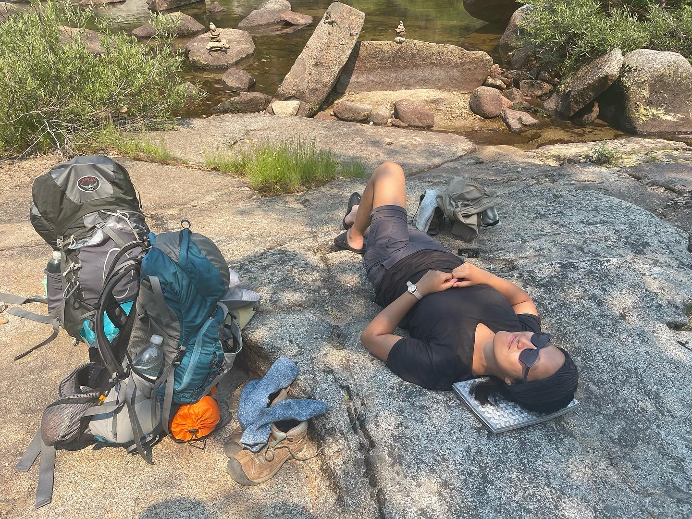

 Backpacking is one of my favorite ways to explore the outdoors! I love being able to experience the solitutde of the backcountry, challenge myself with difficult hikes, and disconnect from the hustle and bustle of everyday life. My number one priority on the trail is to minimize impact so that we can continue to recreate responsibily and experience the wilderness. I try to review the trails that I have done with up-to-date information on trail conditions, weather, bugs, camping tips, and anything else I think is useful - catch me on <a href = "https://www.alltrails.com/members/karina-yap-1" target="_blank">AllTrails</a>!

     

    
    

    
           
            <h3>Things I Care About</h3>
            

            <ul>
                <li>Keeping wildlife wild</li>
                <li>Packing out trash</li>
                <li>Chilling at camp</li>
                <li>Fun trail food</li>
            </ul>
			
                   
    

    

        <h3>Things I Don't</h3>
        

                <ul>
                <li>Maximizing mileage</li>
                <li>Ultralight gear (to be honest, I couldn't tell you what my base weight is)</li>
                <li>Constant gear upgrades - what I have works for me</li>
                <li>Powering through bad weather (not worth!)</li>
             </ul>
        

    

<section>

<h2 id="content">My Packing List</h2>

This is definitely not a strict packing list, and I'll adjust it accordingly based on the needs of my trip, any area restrictions, and the people I'm going with, but here is a list of the items that I'll bring with me on a typical trip

	

	<h3>Camp</h3>
		<ul>
            <li>Tent, rainfly, and footprint OR hammock</li>
            <li>Sleeping pad OR hammock underquilt</li>
            <li>Sleeping bag</li>
            <li>(Optional) Pillow</li>
            <li>Camp shoes (Crocs!) - honestly a must for me</li>
            <li>Head lamp</li>
            <li>Tyvek sheet - I use it to sit on, lay out as a floor mat to my tent, and wrap and protect my sleeping pad. Best piece of trash ever!</li>
        </ul>
	

	

	<h3>Protection from the Elements</h3>
		<ul>
            <li>Extra layers - I always bring a fleece to keep cozy at camp, and if it's extra cold I'll also bring my puffy</li>
            <li>Rain stuff - one should always bring a rain jacket (sometimes I don't, but do as I say, not as I do)</li>
            <li>Base layers</li>
            <li>Bug net</li>
            <li>Bug spray or bug wipes</li>
            <li>Sunscreen (I bring face sunscreen, and wear long pants/long sleeves)</li>
            <li>Baseball cap</li>
            <li>Beanie</li>
         </ul>
	

	

	<h3>Food and Drinks</h3>
		<ul>
            <li>Coffee for breakfast</li>
            <li>Camp cup</li>
            <li>Snacks for lunch</li>
            <li>Snacks on the trail</li>
            <li>Pocket rocket, fuel canister, and cooking cup</li>
            <li>Dinner</li>
            <li>Spork</li>
            <li>Liquid IV (just in case)</li>
            <li>Water filter and reservoirs for collecting and catching the effluent</li>
            <li>Smart water bottles</li>
            <li>Proper food storage if needed (bear can, usually)</li>
        </ul>
	

	

	<h3>Health and Hygiene</h3>
		<ul>
            <li>Poop kit - wet wipes, toilet paper, period products, and extra bags to pack out trash</li>
            <li>Poop shovel</li>
            <li>Toothbrush</li>
            <li>Toothpaste tabs</li>
            <li>Hand sanitizer</li>
            <li>Meds - ibuprofen and allergy meds</li>
        </ul>
	

	

	<h3>My Non-Negotiables</h3>
		<ul>
            <li>Extra bag to pack out trash</li>
            <li>Bandana</li>
            <li>Pack towel</li>
            <li>Small multitool</li>
            <li>First aid kit </li>
            <li>Permit</li>
            <li>Trail map</li>
            <li>Boots</li>
            <li>Trekking poles (slightly neotiable given trail conditions)</li>
         </ul>
	

	

	<h3>My Luxury Items</h3>
		<ul>
            <li>Clean underwear and socks</li>
            <li>Field guide for bird identification</li>
            <li>Binoculars</li>
            <li><a href="https://gamesofberkeley.com/products/pass-the-pigs" target="_blank">Pass the Pigs</a></li>
        </ul>
	

